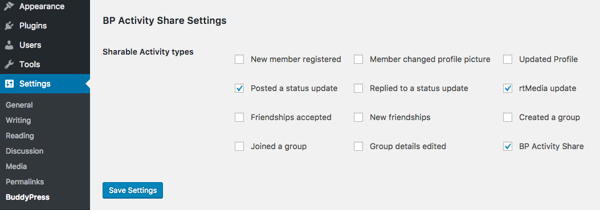

<!-- DO NOT EDIT THIS FILE; it is auto-generated from readme.txt -->
# BP Activity Share

Using BP Activity Share plugin you can share any activity locally like we share any post in FaceBook.

**Contributors:** [sanket.parmar](https://profiles.wordpress.org/sanket.parmar), [pranalipatel](https://profiles.wordpress.org/pranalipatel)  
**Tags:** [buddypress activity share](https://wordpress.org/plugins/tags/buddypress activity share), [buddypress share](https://wordpress.org/plugins/tags/buddypress share), [activity](https://wordpress.org/plugins/tags/activity), [buddypress](https://wordpress.org/plugins/tags/buddypress)  
**Requires at least:** WordPress 4.0  
**Tested up to:** WordPress 4.6.1  
**Stable tag:** 1.0.0  
**License:** [GPLv2 or later](http://www.gnu.org/licenses/gpl-2.0.html)  

## Description ##

BP Activity Share plugin is useful for sharing an activity locally like we are sharing any post in FaceBook.

If you really like this plugin, you can rate here -> https://wordpress.org/support/plugin/bp-activity-share/reviews#new-topic-0

## Installation ##

### From your WordPress dashboard ###
1. Visit 'Plugins > Add New'
2. Search for 'BP Activity Share'
3. Activate BP Activity Share from your Plugins page.

### From WordPress.org ###
1. Download BP Activity Share.
2. Upload the 'bp-activity-share.zip' directory to your '/wp-content/plugins/' directory, using your favorite method (ftp, sftp, scp, etc...)
3. Activate BP Activity Share from your Plugins page.

## Frequently Asked Questions ##

### Can I use my existing WordPress theme? ###
Yes! BP Activity Share works out-of-the-box with nearly every BuddyPress supported theme.

## Screenshots ##

### Shared Activity

## Changelog ##

### 1.0.0 ###
* Inital Release
* Share any existing activity locally

## Upgrade Notice ##

### 1.0.0 ###
Share any existing activity locally

